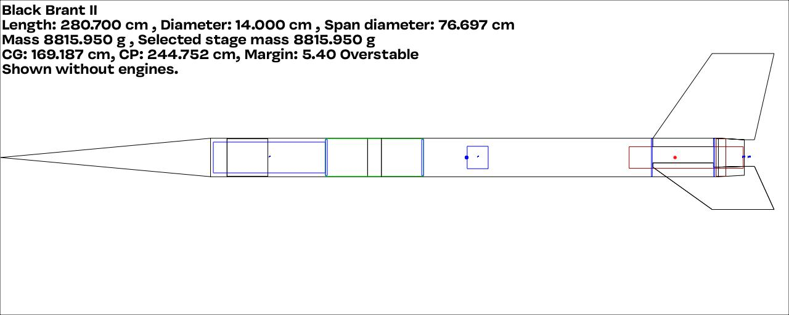

The Black Brant II was a very successful sounding rocket produced by the Canadian Armament Research and Development Establishment (CARDE) beginning 1960. This is my build of a 5.5" diameter model of the three fin version.

The design is shown here and the [Build info](/docs/builds/black-brant-ii/) is provided in the docs section.

I'm tempted to fly this with a _reversed_ parachute configuration where the drogue is located in the forward payload bay and the main in the aft section. Mainly because of the pace constraints and squeezing a large main in the fwd payload will be a really tight fit!
