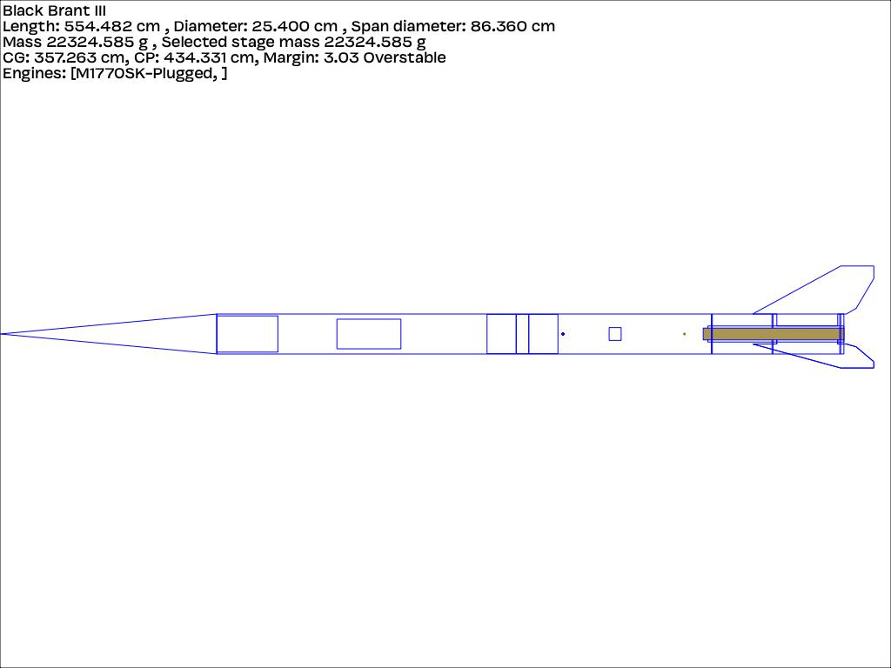
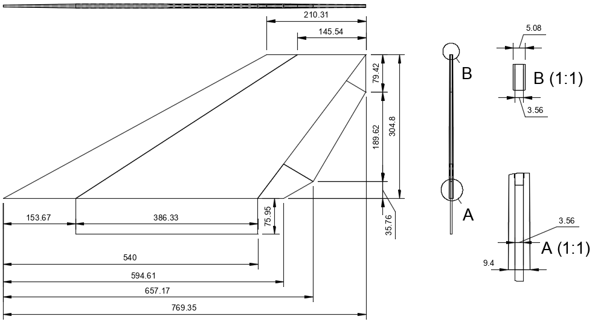

## Project Overview

This document describes the approach and detailed design of a full-scale model of the Black Brant III sounding rocket.

## Construction Approach

The overall construction follows standard parctice and materials currently in ue for high-power amateur rockets. The main materials consist of:

* Cardboard tubes
* Fibreglass composites
* Carbonfibre composites
* Epoxy adhesives

Electronics used consist of commerciallly available flight computers. Specifically the Egg Timer Proton.

### Overview

The overall design is provided here

The design is based on original drawings

### Airframe

The airframe is constructed from cardboard postal tubes 10" diameter and 3mm wall thickness. These tubes are wrapped in two layers of XXX fibreglass. The design uses two sections of airframe coupled together with an avionics bay. The aft section of the airframe is slotted to allow for "through the wall" mounting of the fins

### Fins

The fins are constructed using a core comprised of 3mm plywood laminted with carbon fibre. This core is "sandwiched" on both sides with 3mm plywood shaped to the profile of the original fin design shown here.

The complete fin assembly is then lamiminated with fibreglass. The Vacuum bagging technique is used for all fin lamination to ensure optimal epoxy/cloth ratios.

The intial design for the fins is provided here.

### Motor

The design uses a 98mm motor mount. Initial flights will use a 75mm CTI motor adapted to 98mm

### Simulations

Initial simulations are provided here
